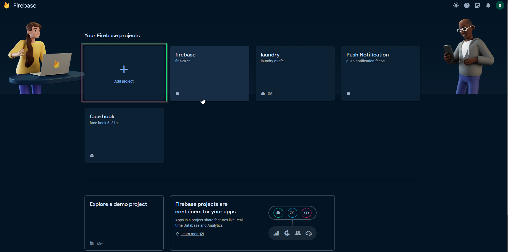
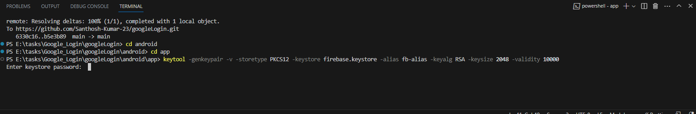
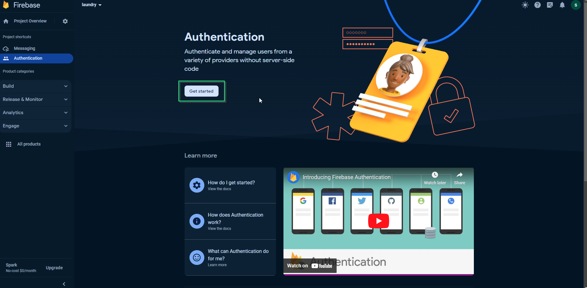
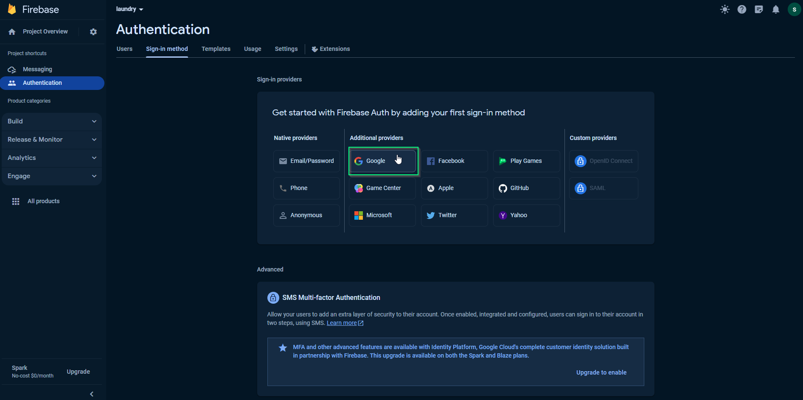
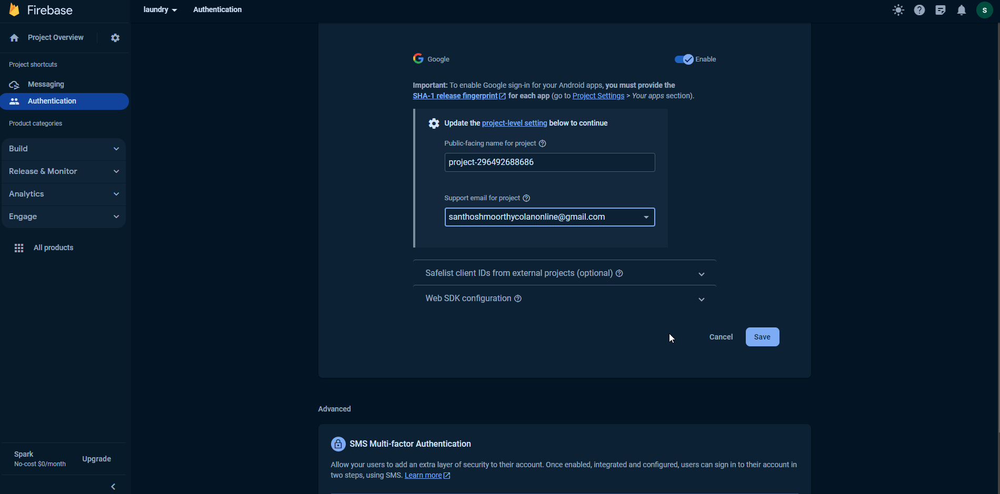
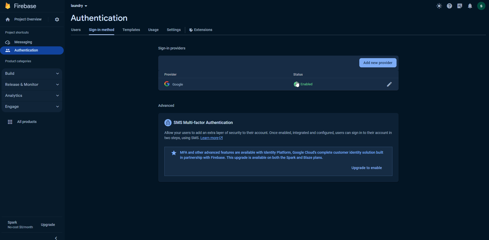
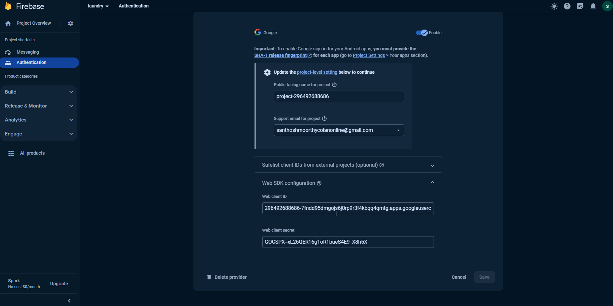

# Google Sign - RN(Android)

Google Sign-in integration with React native app

# Prerequisites

Create firebase new project
Integrate firebase setup
Enable google sign-in provider method
Generate sha-1 and sha-256 key(Mandatory)

## Install Firebase and google sign-n React Native SDKS

```bash
# using npm
npm install @react-native-firebase/auth --save
npm install @react-native-google-signin/google-signin --save
npm install @react-native-firebase/app --save
```

### Create new firbase project in firebase console



### First, add the google-services plugin as a dependency inside of your /android/build.gradle file:

```bash
buildscript {
  dependencies {
    // ... other dependencies
    // NOTE: if you are on react-native 0.71 or below, you must not update
    //       the google-services plugin past version 4.3.15
    classpath 'com.google.gms:google-services:4.4.0'
    // Add me --- /\
  }
}
```

### Lastly, execute the plugin by adding the following to your /android/app/build.gradle file:

```bash
apply plugin: 'com.android.application'
apply plugin: 'com.google.gms.google-services' // <- Add this line
```

[**Integrate firebase setup**](https://rnfirebase.io/)

### Generate key store file andGenerate sha-1 and sha-256 key

#### Method 1

i, Generate key store file

Go to your project root folder > android > app > keytool -genkeypair -v -storetype PKCS12 -keystore firebase.keystore -alias fb-alias -keyalg RSA -keysize 2048 -validity 10000

```bash
keytool -genkeypair -v -storetype PKCS12 -keystore firebase.keystore -alias fb-alias -keyalg RSA -keysize 2048 -validity 10000
```



enter password : santhosh@111
re enter password : santhosh@111
what is your first and last name? : santhosh kumar
what is the name of your organization unit? : demo organization
what is the name of your organization ? : demo organization
what is the name of your city or locality? : madurai
what is the name of your state or province? : india
what is the two-letter country code for this unit? : IN

finally you will received your keystore file in your project root folder > android > app

ii, Generate sha-1 and sha-256 key

Go to your project root folder > android > app > keytool -list -v -keystore firebase.keystore fb-alias androiddebugkey -storepass santhosh@111 -keypass santhosh@111

```bash
keytool -list -v -keystore firebase.keystore fb-alias androiddebugkey -storepass santhosh@111 -keypass santhosh@111
```

keytool -list -v -keystore <**keystore file name**> <**alias name**> -storepass <**password**> -keypass <**password**>

Ex : keytool -list -v -keystore firebase.keystore fb-alias -storepass santhosh@111 -keypass santhosh@111

finally you will get sha-1 and sha-256 key

# Enable Authentication from Firebase Console

1. Now open your firebase project in Firebase console and click the Authentication option in the left side tab





click and fill support mail for project and save



### After Enabled google page will appear:



Please scroll down and find web SDK configuration option, click on it and you will find web client ID, please remember you have to copy-paste this web client ID in the code below so keep it open or paste it somewhere.



---
